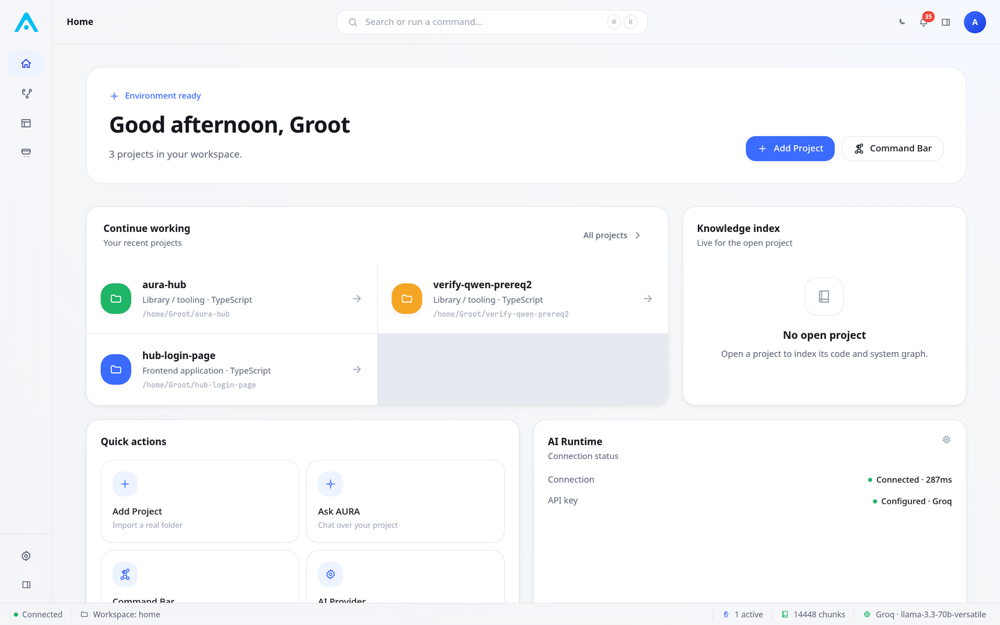

# AURA Hub — Website

[](https://github.com/Aura-hub-ai-native-workspace/aura-hub-website/actions/workflows/link-check.yml)
[](LICENSE)

The public marketing site for [AURA Hub](https://github.com/Aura-hub-ai-native-workspace/aura-hub), the AI-native engineering environment. This repository contains **only** the static website — no application code, no build tooling.

It is a single self-contained HTML page (`index.html`) with inline CSS and JavaScript, plus an `assets/` folder of images. There is no framework, no package manager, and no build step.

## Screenshots

The site itself showcases product screenshots, served from `assets/screenshots/`:

<p>
  
  
</p>
<p>
  
  
</p>

The full set (`01`, `03`, `04`, `07`–`13`) is used across the hero, product showcase, screenshots grid, and interactive demo sections of `index.html`. The brand mark used for the favicon, nav logo, and footer is `assets/brand/aura-logo.png`.

## Deployment

This repository is ready to deploy as-is to any static host — no build step, no application dependencies.

### Cloudflare (Workers Static Assets — current default)

Cloudflare has moved new "Workers & Pages" projects onto **Workers with Static Assets**, the successor to classic Pages. `wrangler.jsonc` in this repo configures that for you:

```jsonc
{
  "name": "aura-hub-website",
  "compatibility_date": "2026-08-07",
  "assets": { "directory": "./", "not_found_handling": "404-page" }
}
```

There's no Worker script (`main` is intentionally omitted) — this is asset-serving only, not compute. To deploy:

1. In the Cloudflare dashboard: **Workers & Pages → Create application → Connect to Git**, select this repo (`aura-hub-website`).
2. Leave the **Build command** empty and the **Deploy command** as the prefilled `npx wrangler deploy` — it reads `wrangler.jsonc` automatically.
3. Deploy. `_headers` (security + caching) and `robots.txt`/`sitemap.xml` are picked up natively from the asset directory, same as they were under Pages.

Connect this repo on its own — not as a subfolder of the `aura-hub` monorepo, whose Node/Tauri tooling caused Cloudflare to misdetect the project type before the site was split out.

### Classic Cloudflare Pages (if still available on your account)

Framework preset **None**, build command empty, output directory `/` — works identically without needing `wrangler.jsonc` at all.

### Other static hosts

Because it's just an HTML file and an image folder, it also works unmodified on:

```bash
# Netlify
npx netlify deploy --dir=. --prod

# Vercel
npx vercel --prod

# GitHub Pages
# Settings → Pages → Deploy from branch → / (root)
```

Or simply open `index.html` directly in a browser — the page has no server dependency and works fully offline.

## Repository contents

| File | Purpose |
|---|---|
| `index.html` | The entire site — markup, styles, and script, self-contained |
| `404.html` | Custom not-found page, matches site branding |
| `robots.txt` | Allows all crawlers, points to `sitemap.xml` |
| `sitemap.xml` | Single-URL sitemap for search engines |
| `_headers` | Cloudflare Pages security + caching headers |
| `assets/` | Brand mark and product screenshots |
| `.github/workflows/link-check.yml` | CI: fails a PR/push if a link or asset reference breaks |

## Updating

Edit `index.html` directly; it's plain HTML/CSS/JS. To update a screenshot, replace the file in `assets/screenshots/` under the same filename referenced in the markup. If the canonical domain ever changes, update it in three places: `index.html` (`<link rel="canonical">`, `og:url`, `og:image`, `twitter:image`), `robots.txt`, and `sitemap.xml`.

## Links

- Main project: [github.com/Aura-hub-ai-native-workspace/aura-hub](https://github.com/Aura-hub-ai-native-workspace/aura-hub)
- Live site: [aurahub.is-a.dev](https://aurahub.is-a.dev) *(once Cloudflare Pages is connected — see Deployment above)*
- Contact: hello@aurahub.dev

## License

Apache License 2.0 — see [LICENSE](./LICENSE).
